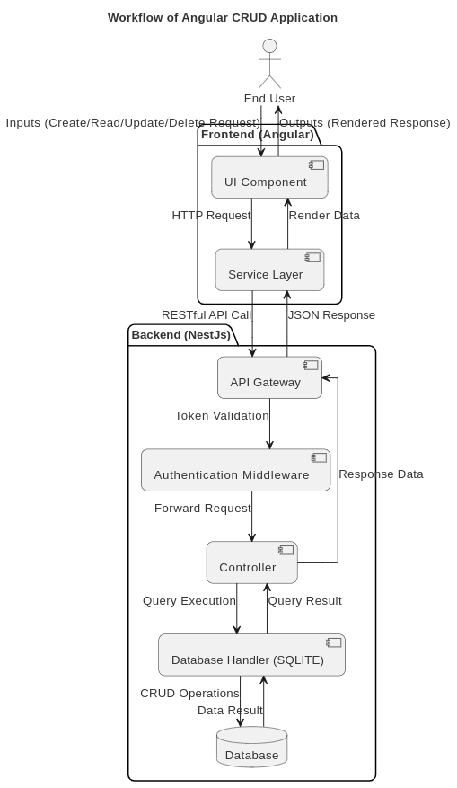

# Web Project 

# Introduction
Ce projet vise à développer une application web pour la gestion des associations et des utilisateurs. Il se compose de deux parties principales :

- **Backend** : Développé avec NestJS et SQLite, il fournit des services robustes et des APIs pour la gestion des entités, la résolution des dépendances cycliques et les opérations CRUD.
- **Frontend** : Construit avec Angular, il propose une interface utilisateur intuitive pour interagir avec le backend.

---

## Partie Backend

### Objectifs

- **CRUD pour les entités** : Implémentation des opérations CRUD (Create, Read, Update, Delete) pour toutes les entités principales.
- **Gestion des relations** : Modélisation des relations complexes entre les entités (ex. : clés composites).
- **APIs spécifiques** : Fournir des endpoints adaptés à des cas d'utilisation précis.
- **Dépendances cycliques** : Utilisation de `forwardRef()` pour garantir la stabilité de l'application.

### Technologie utilisée

- **Framework** : NestJS
- **Base de données** : SQLite
- **Langage** : TypeScript
- **Documentation des APIs** : Swagger

### Lancement du backend

1. Installer les dépendances :
   ```bash
   npm install
   ```
2. Démarrer le serveur :
   ```bash
   npm run start
   ```
3. Accéder à la documentation des API :
   [http://localhost:3000/api](http://localhost:3000/api)

### Entités et Relations

#### 1. Users
Représente les utilisateurs avec un `id` et un `nom`.

#### 2. Associations
Groupes d'utilisateurs.

#### 3. Rôles
Identifie le rôle des utilisateurs au sein d'une association. Utilise des clés composites.

#### 4. Procès-verbaux (Minutes)
Comptes rendus des assemblées générales, associés à une association et plusieurs utilisateurs.

### Exemple d'API CRUD

#### Users
- `GET /users` : Liste des utilisateurs
- `POST /users` : Création d'un utilisateur
- `PUT /users/:id` : Mise à jour d'un utilisateur
- `DELETE /users/:id` : Suppression d'un utilisateur

#### Associations
- Similaires aux utilisateurs

#### Rôles et Minutes
- Implémentent des endpoints spécifiques

### Résolution des dépendances cycliques

Les dépendances entre modules comme `UsersModule` et `RolesModule` ont été résolues avec `forwardRef()`, permettant d'initialiser les modules dépendants sans erreur.

### Tests et Validation

- Tests des API avec des scripts comme `dev_specific_apis.sh`.

---

## Partie Frontend

### Outils utilisés

- **Node.js**
- **Angular CLI** : Installé via `npm install -g @angular/cli`
- **Visual Studio Code**

### Lancement du frontend

1. Installer les dépendances :
   ```bash
   npm install
   ```
2. Démarrer le serveur Angular :
   ```bash
   ng serve
   ```
3. Accéder à l'application :
   [http://localhost:4200](http://localhost:4200)

### Fonctionnalités principales

1. **Authentification**
   - Page de connexion : Vérifie les informations d'identification avec le backend et stocke le jeton JWT dans `localStorage`.
   - Déconnexion : Supprime le JWT et redirige vers la page de connexion.

2. **Gestion des utilisateurs**
   - Afficher la liste des utilisateurs
   - Ajouter, mettre à jour et supprimer un utilisateur

3. **Gestion des associations**
   - Créer, modifier et supprimer une association

### Architecture et Technologies

- **Angular Material** : Composants UI modernes
- **HTTP Client** : Communication avec le backend via `HttpClientModule`
- **Guards** : Protection des routes sensibles (ex. : `AuthGuard`)


## Rest API diagram


## 🏠 Architecture


This database architecture is designed to track and organize information about associations, users, events, minutes, and
roles.

The `association`, `event`, `minute`, and `role` entities each have a many-to-one relationship with the `association`
entity, as they each contain a foreign key to the association table. This allows events, minutes, and roles to be
organized and tracked by association.

The `association` and `user` entities have a many-to-many relationship, which is represented by
the `association_users_user` junction table. This junction table allows multiple users to be associated with multiple
associations, and vice versa.

The `minute_voters_user` junction table represents a many-to-many relationship between the `minute` and `user` entities,
allowing multiple users to vote on multiple minutes.

### API and swagger


We’ve designed a REST API that mirrors the database structure, making it easy to understand and use. This alignment ensures consistency between the database and the API, helping developers quickly grasp how the data is organized and accessed.

Additionally, the API is documented with Swagger, providing an interactive interface for exploring and testing the API endpoints. By reflecting the database relationships, such as many-to-many connections between associations and users or between minutes and voters, the design simplifies the API and makes it more intuitive.

## Workflow



### Exemple de code

Ajout d'une route :
```typescript
const routes: Routes = [
  { path: '', component: LoginComponent },
  { path: 'users', component: UsersListComponent, canActivate: [AuthGuard] }
];
```

Requêtes HTTP :
```typescript
this.http.get('http://localhost:3000/users').subscribe(
  data => this.dataSource = data,
  error => console.error('Erreur:', error)
);
```

### Tests

- **Tests automatiques** : Générés avec Angular CLI
- **Tests manuels** : Vérification de l'authentification, des requêtes CRUD et de la navigation entre les pages

---

## Conclusion 

Ce projet propose une solution complète pour la gestion des associations et des utilisateurs, en combinant :

- Un **backend** robuste et modulaire avec NestJS et SQLite.
- Un **frontend** moderne et intuitif avec Angular et Angular Material.


CRUD :

curl -X POST -d 'firstname=Jane&lastname=Doe' http://localhost:3000/users/
curl http://localhost:3000/users
curl -X PUT -d 'firstname=Jane' http://localhost:3000/users/0
curl -X DELETE http://localhost:3000/users/0

